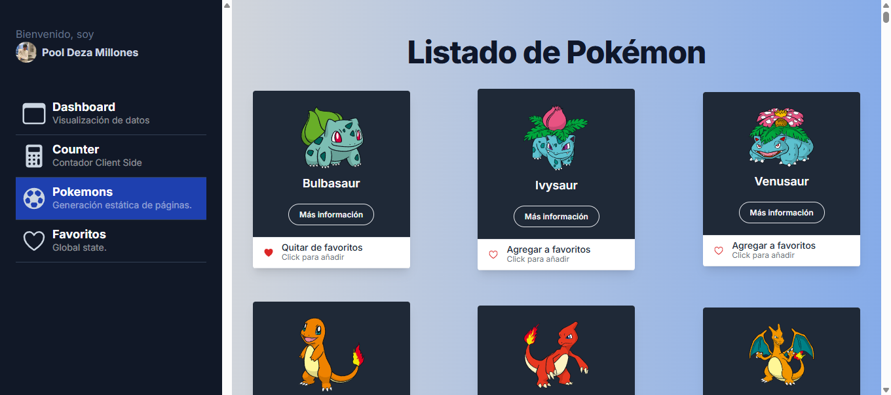
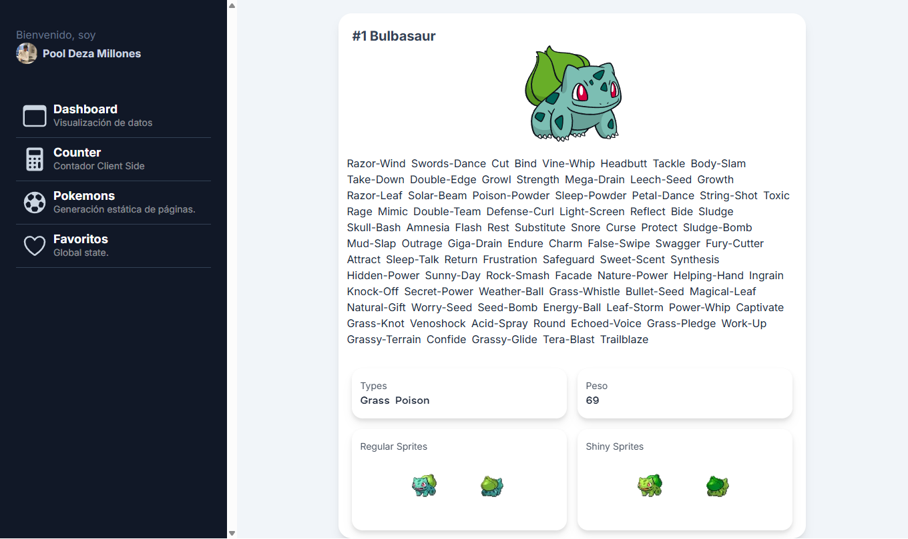

# Pokemon 150 - Pokédex App

Una aplicación web moderna construida con Next.js que muestra información detallada de los primeros 150 Pokémon.

## 🌟 Características

- **Lista de Pokémon**: Visualiza los primeros 150 Pokémon con sus imágenes y datos básicos
- **Detalles del Pokémon**: Información completa incluyendo estadísticas, tipos, habilidades y evoluciones
- **Diseño Responsive**: Optimizado para dispositivos móviles y desktop
- **Interfaz Intuitiva**: Navegación fácil y búsqueda rápida
- **Datos Actualizados**: Información obtenida de la PokéAPI

## 🚀 Demo


*Vista de la lista principal con todos los Pokémon*


*Vista detallada mostrando información completa del Pokémon seleccionado*

## 🛠️ Tecnologías Utilizadas

- **Next.js 14** - Framework de React
- **React** - Librería de UI
- **TypeScript** - Tipado estático
- **Tailwind CSS** - Estilos
- **PokéAPI** - Datos de Pokémon

## 📦 Instalación

1. Clona el repositorio:
```bash
git clone https://github.com/tu-usuario/pokemon150.git
cd pokemon150
```

2. Instala las dependencias:
```bash
npm install
```

3. Ejecuta el servidor de desarrollo:
```bash
npm run dev
```

4. Abre [http://localhost:3000](http://localhost:3000) en tu navegador.

## 🎯 Funcionalidades

### Lista de Pokémon
- Muestra cards con imagen, nombre e ID de cada Pokémon
- Grid responsive que se adapta al tamaño de pantalla
- Carga optimizada de imágenes

### Página de Detalle
- Información completa del Pokémon seleccionado
- Estadísticas visuales
- Tipos y habilidades
- Cadena de evolución

## 📁 Estructura del Proyecto

```
pokemon150/
├── src/
│   ├── app/
│   │   ├── page.tsx          # Página principal (lista)
│   │   ├── pokemon/
│   │   │   └── [id]/
│   │   │       └── page.tsx  # Página de detalle
│   │   └── layout.tsx
│   ├── components/
│   │   ├── PokemonCard.tsx
│   │   ├── PokemonList.tsx
│   │   └── PokemonDetail.tsx
│   ├── lib/
│   │   └── api.ts           # Funciones de API
│   └── types/
│       └── pokemon.ts       # Tipos TypeScript
├── public/
│   └── screenshots/
└── README.md
```

## 🔧 Scripts Disponibles

- `npm run dev` - Ejecuta el servidor de desarrollo
- `npm run build` - Construye la aplicación para producción
- `npm run start` - Inicia el servidor de producción
- `npm run lint` - Ejecuta el linter

## 🌐 API

Este proyecto utiliza la [PokéAPI](https://pokeapi.co/) para obtener datos de Pokémon:

- **Lista de Pokémon**: `https://pokeapi.co/api/v2/pokemon?limit=150`
- **Detalle del Pokémon**: `https://pokeapi.co/api/v2/pokemon/{id}`

## 🤝 Contribución

Las contribuciones son bienvenidas. Para cambios importantes:

1. Haz fork del proyecto
2. Crea una rama para tu feature (`git checkout -b feature/nueva-funcionalidad`)
3. Commit tus cambios (`git commit -m 'Añadir nueva funcionalidad'`)
4. Push a la rama (`git push origin feature/nueva-funcionalidad`)
5. Abre un Pull Request

---

⭐ Si te gusta este proyecto, ¡dale una estrella en GitHub!